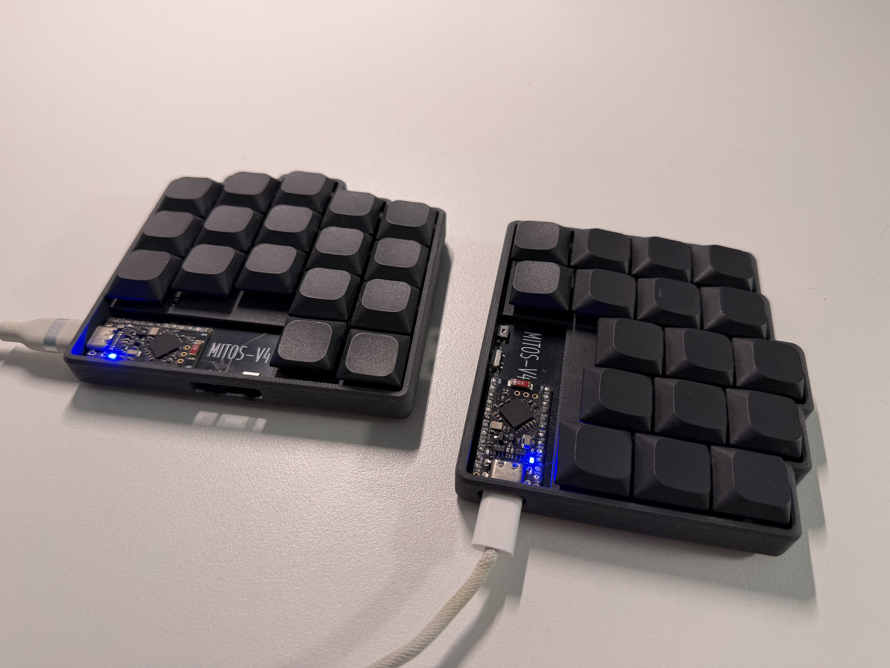
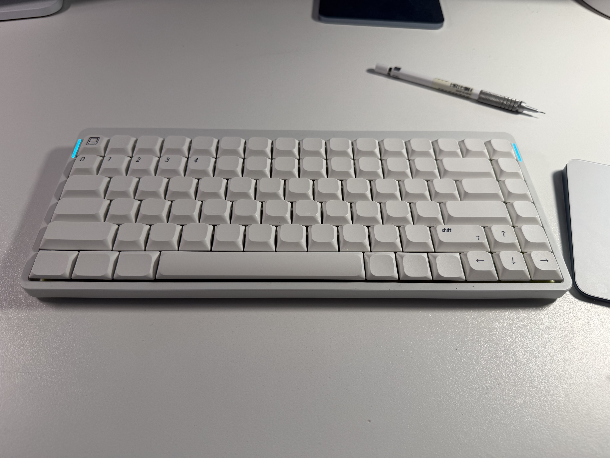
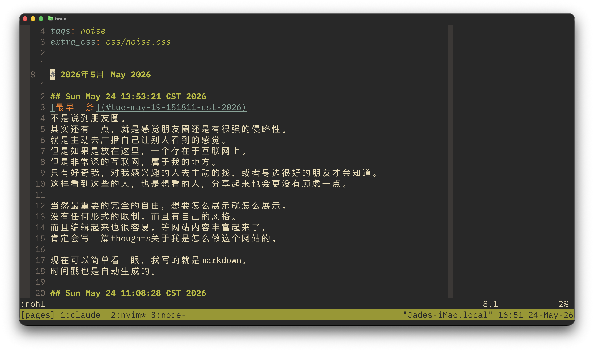

# 2026年5月 May 2026

## Sun May 31 22:25:52 CST 2026
还有前面几篇thoughts有点写的太做作了。
毕竟好久没有认真写东西了，还是不太自在。
[最新的一篇](/src/thoughts/npm-experience.md),
感觉找到了一些感觉，写的就流畅了很多。

## Sun May 31 22:22:58 CST 2026
在写关于球桌的时候发现前几天写的插件居然有小bug。
修复一下，更新一下thoughts里的内容。

## Sun May 31 17:08:16 CST 2026
新发了关于家里的
[新球桌](../thoughts/pool-table.md)
的一些分享。
而且呢，关于怎么做这个网站的也开始写了，今天或者明天吧。
早点走整理完了，可以去忙的别的事情了。
而且下个月（啊就是明天了吗）估计就开始学车了，而且暑假的学分也要开始修了。

## Sun May 31 16:55:30 CST 2026
这两天终于是用了一段时间的opus。
非常感谢
[张一弛](https://www.yichi.studio/)
提供的Max账号。
(点名的话应该不介意吧。 本人看见了再说吧。）
虽然一直在用Claude-code，但是一直使用的是sonnet，
从来没有用过一次opus。仅仅只是在网上看到被说的很厉害。

但是既然有机会让我opus也管饱，那我自然是要试试的。
不过呢，试了几天其实没有感受到明显的差距吧。
其实也不能这么说，就是目前用下来，没有让我失望过。
所有的任务任务都可以完成，也都和我想象的差不多。
说慢嘛，也还行，没有明显到不可以接受的成都。

不过很有可能是我很少独立让llm去完成很复杂的任务，
一般都是问，了解，写非常小很具体的函数。
展现不出来opus的优势。
总的来说我用的还是比较小心的，之前用sonnect的时候，
它写的代码无论是风格上还是逻辑上，都是有改进空间的，
比如在做这个网站的时候，因为确实没接触过javascript，
很多功能是先让sonnet写，能跑起来再说。
但后来几乎每个小模块我在重看的时候都改了不少。
再用两天观察下opus。

## Sat May 30 23:32:45 CST 2026
终于把做这个网站的所有代码整理好了，之前很多是克劳德写的，
先保证能用再说，导致结构上挺乱的，
质量挺低的。
这两天读了很多javascript，也有很多有意思的设计，
每次用接触新语言还挺有意思的，
过两天有空就可以分享一下整个网站是怎么做的。

## Sat May 30 21:58:19 CST 2026
好累。家里买了球桌，我爸找了公司里的电工来装灯。
这个灯是四个角的吊灯，而我们家阁楼的天花板是不规则的，
需要在天花板打膨胀螺丝，可想而知定位很复杂。

结果呢，这群人很自信的拿个激光测距仪，电钻就来了。
没错，甚至不是电锤或者冲击钻。打的孔就非常歪。
明显可以看出来线不垂直。

今天忙了半天，一直到晚上九点多。
借了冲击钻和激光水平仪，最后结果很满意，虽然还是有瑕疵。
毕竟补上了之前洞，有重新打了。
吐槽一下我爸这个电线接的铜丝都漏一大截，还要我返工。
但没办法啊，我还不够高，顶上孔还有电线我都够不着。

其实用激光水平仪定位还是非常有意思的，
而且它非常巧妙的设计可以轻易的找到在地面任意处正上方的位置。
其实应该写一篇thoughts，可惜太专注了，而且没有意识，
就没有留下什么照片。但是还是可以写写，后补上一些演示画面。

## Fri May 29 10:31:59 CST 2026
哈，充好电了，用了一一会儿。
笑飞了。完全不会打字了。
字母区没有什么问题，打字速度不会下降很多。
但是tab几乎忘记在哪里。
空格必须右手按。左手是删除。
这导致我总是想要确认但是把打的东西删掉了。
还有老生常谈的，b在左手。b在左手。
死手听话啊。

## Fri May 29 09:09:59 CST 2026
又是HN，让我看到
[nice!nano](https://nick.winans.io/blog/nice-nano/)
居然是是这个人大一做的项目。
高三的时候，花时间做的最多的项目就是那把键盘，
也是基于nice!nano(不过用的博客里提到的淘宝盗版，错了，国内真买不到)。

现在不怎么用了，主要电池小，而且蓝牙没有那么稳定。
还是上次提到的，做个demo很简单的，但是要优化维护做好非常非常麻烦。

刚拿出来充个电发现还可以用。
也许暑假可以再优化一下？太久不搞这些3D打印机落得全是灰。
稍微想一下如果要改的话，东西还挺多的。
比如现在充电的时候没有办法关掉，因为没有单独的开关，
目前开关直接连电池，关掉就没法充电了。
还有插电脑充电的时候是应该还是蓝牙优先，
现在会和有线链接冲突。
因为本来就没设计有线模式，可以设计一个。
而且为了极致的压缩体积，用的电池还是小了点，没几天就要充电。
除了设计有线模式还应该可以外接大电池，分体当做一体用。

顺便一提，现在主要用的是
[nuphy air v2](https://nuphy.com)
，也是非常不错的产品。
用别人做好的东西好处就是不用自己维护，还是相当方便的。
没错，我懒。

## Thu May 28 13:07:07 CST 2026
上午把上次提到的盘古之白打包了一个
[markdown-it](https://github.com/markdown-it/markdown-it)
插件。
其实一个比较普遍的问题，加空格的解决方案也确实有问题。
比如在我用的字体下，空格会宽一点。
发布在
[npm](https://www.npmjs.com/package/markdown-it-pangu-pro)
上了。

## Thu May 28 13:02:57 CST 2026
发现了一些没听过的毛不易。

有一首叫《明天的孩子们》。
其实就是明日之子，写的参加选秀的时候一些事情吧，反正我没看过。

还有一首非常离谱版本的《南一道街》，feat马伯赛。
通过上一首的歌词我们可以知道，应该是同期的选手。
就很抽象，听了想笑，就是，本来可能很抒情的歌，突然夹杂着rap。

## Wed May 27 21:12:20 CST 2026
高中毕业之后，虽然在国外上学，但是在盐城的时间反而变多了。
这才意识到，好多东西，都比记忆中小了很多。
客厅，阁楼，还有麦当劳。

## Tue May 26 17:38:41 CST 2026
想要把任何一件事情做做完备真的比想象中要麻烦。
总是有各种各样的细节，只有着手去做的时候才可以感受到。
哪怕是作为用户都感受不到。

比如在做这个网站的时候，有一个很有意思的说法，叫做盘古之白（pangu spacing）。
指的是西文字符（包括数字）和中文字符放在一起的时候，
中间应当有一个宽度为1/4中文字符宽度空隙。
可以注意到很多操作系统，比如ios，在输入的时候就会自动生成这样的空间。
但是那我做这个网站的时候就没有这么好的事情了，排版什么都要自己控制。
最开始我在写的时候会手动加入一个半角空格，其实很麻烦，经常漏掉。
最近才添加上了自动生成的代码。

这也就是为什么很多开发者其实不太喜欢做开源项目。
用户会提一堆意见，好像这个功能的实现很简单一样。
但是实际写起来很复杂，再加上没有金钱上的回报，就会很累。
再加上有llm的帮助，好像写个功能只要提个要求就可以自动生成。
但我用llm的感受就是，llm确实能做事，但是方案总是很直接。
但明明好好想想就有更简洁的方案。
这就导致要是llm写出来的，容易可维护性越写越差，所谓屎山代码。

## Tue May 26 14:41:28 CST 2026
到底什么时候才可以熬到下一个晴天。

很奇怪的是，以前晚上工作的时候也从来不在意天气，什么都看不到就算了。
现在早睡早起了，反而总是会被天气影响心情。

以前我总说天气不好，已经记不清是谁指出来，不能歧视阴天。

## Mon May 25 18:30:27 CST 2026
本来写了一写关于新球杆，但是越写越多，就不放在这里了。
放到 
[thoughts](../thoughts/new-cue.md)
里面了。

## Mon May 25 16:54:07 CST 2026
最近有机会用了
[lua](https://www.lua.org/)。
非常有意思的语言。

首先它所有的这些数据结构都是table。
没有array啊，dictionary这种区分。统统都是table。
但里面什么东西都可以放，可以放function，可以放键值对。
这让这个table完全可以当作class来使用。
里面放的function第一传入自己作为变量就可以是method。

然后它还支持一个给代码打
[标签](http://lua-users.org/wiki/GotoStatement)。
这就很像写assembly做branch。
整个流程的控制就可以灵活很多。

不过也有一个有点烦人的设计，就是1-based index。
说实话只写lua的话也就还好。
但是和别的语言或者设计混在一起用，index就总是要加减一。
比如最近写的
[nvim插件](https://github.com/Zhou-Xuanyu/md-lite.nvim)
所有的原生API都是0-index。这怎么办吧。

## Sun May 24 17:00:03 CST 2026

[最早一条](#tue-may-19-151811-cst-2026)
不是说到朋友圈。
其实还有一点，就是感觉朋友圈还是有很强的侵略性。
就是主动去广播自己让别人看到的感觉。
但是如果是放在这里，一个存在于互联网上。
但是非常深的互联网，属于我的地方。
只有好奇我，对我感兴趣的人去主动的找，或者身边很好的朋友才会知道。
这样看到这些的人，也是想看的人，分享起来也会更没有顾虑一点。

当然最重要的完全的自由，想要怎么展示就怎么展示。
没有任何形式的限制。而且有自己的风格。
而且编辑起来也很容易。等网站内容丰富起来了，
肯定会写一篇thoughts关于我是怎么做这个网站的。

现在可以简单看一眼，我写的就是markdown。
时间戳也是自动生成的。

## Sun May 24 11:08:28 CST 2026
感觉我还是需要写日记的。
才意识到，很多事情真的想不起来了。
尤其是不开心的回忆，只能记得个结果，但是具体发生了什么，
当时是怎么想的都记不起来了。
这些记忆真的就消失，想要去找也找不到了。
时间就这样过了一年，两年，三年。

## Fri May 22 18:31:47 CST 2026
最近有空写了一个nvim插件，
[md-lite](https://github.com/Zhou-Xuanyu/md-lite.nvim)。
markdown嘛，主要设计的时候就是不想要被渲染，保证一个纯文本的可读性，
同时又有标记作用的语言，甚至说不上语言，就是工具。
但是在写的这个编号列表的时候，我总是习惯性的只写`1.`。
这在大多数情况下没有问题，但是在我的待办事项里，所有的都显示为1
就看不出来到底有多少事情了。所以还是想要一个可以时时渲染列表的功能。

也许有人会说，为什么不手写`1. 2. 3.`。这样有另外一个问题，
就是在代办里面，很多时候我不会完全按照顺序来做事情。
总不能每做完一件事就要改一遍。
而且，理想情况下，代办是一个queue，不能是stack，
所以先进来最好是先做，哪怕完全按照顺序做也每次都要更新整个列表。

虽然市面上有很多功能很完善的插件，包括我之前在用的
[render-markdown](https://github.com/MeanderingProgrammer/render-markdown.nvim)。
不过之前也说了，markdown最初设计也是为了纯文本的可读性。
所以我也不想要过度的以来渲染。
于是就有了这个自己写个小插件的想法。

具体的细节也许会写一片thoughts。
不过这次写这个列表渲染第一次在实践中用到了recursion。
而且想到这个nested list的问题就立刻联系到recursion。
以前都是iteration写的多，不会recurse。
这种刚学到的东西就用起来的感觉很好。
而且本来llm提出的方案也是用了循环，我没仔细看就讲了我的想法。
诶，他还说我这个好嘞。虽然可能他只是在啊对对对。
但是还是挺开心的。
总的来说，很喜欢recursion这种思路的感觉，
把问题转化成一样的但是更小的问题。
Mathematical Induction也是这样的思路。

## Thu May 21 11:44:49 CST 2026
又是在
[hacker news](https://news.ycombinator.com/news)
上看到了这篇
[文章](https://openai.com/index/model-disproves-discrete-geometry-conjecture/)。
讲的就是openai，用他们的模型证明了一个数学问题嘛。
毕竟不是相关领域的，具体论文也没有看，看了一不一定看的懂。
不过KN上有一个评论很有意思。

> cpard:
>
> *The proof brings unexpected, sophisticated ideas from algebraic number theory to bear on an elementary geometric question.*
>
> The more I read about these achievements the more I get a feeling that a lot of the power of these models comes from having prior knowledge on every possible field and having zero problems transferring to new domains.
>
> To me the potential beauty of this is that these tools might help us break through the increasing super specialization that humans in science have to go through today. Which in one hand is important on the other hand does limit the person in terms of the tooling and inspiration it has access to.

让我想到了总是反反复复听到的一个观点：
当今这个时代已经不存在像达芬奇那样的全才。
包括我今天早上刚看到《吃货的生物学修养》的一句话。

> 而要让一个哪怕是受过大学理工科教育的人看出“下丘脑弓状核和腹内侧核之间神经肽Y神经元的环路链接”到底是在说什么事情也几乎是不可能完成的任务

其实都在说，现在大家的做的事情是越来越分化了，越来越专一的了。
目前看来虽然LLMs没有那么创新和突破，但至少是相当擅长已知知识的迁移。
平行的迁移。

题外话，最近开始看HN，这个社区也非常有意思。
他没有主动生产任何内容，所有投稿都是站外链接。
但是用户会在这里讨论。大家总体都挺友好的。
算法会排序内容。
而且虽然叫hacker news但是什么内容都有。
[原话](https://news.ycombinator.com/newswelcome.html)
是:

> good hackers aren't only interested in hacking, but they(stories on HN) do have to be deeply interesting.

很喜欢这样的设计，简单，有效。足够好。

非常不喜欢现在各家都把自己软件做成融合怪。
不过他们要赚钱，希望的到所有人的注意力，也确实没办法。

## Wed May 20 22:26:59 CST 2026
昨天在
[hacker news](https://news.ycombinator.com/news)
上看到了这个
[网站](https://clickclickclick.click/#3f74fd0004cc0ed72601183e7f01f90e)。
非常有意思。
本身算是一个非常完全的演示，
展示了一个网页可以读取到并且利用的各种各样的信息。
然后用这些信息做了个一个成就系统，很不错的想法，
有机会可以好好学习一下。

不过最重要的是，其实这也暴露一些隐私问题。
就比比如说所有的操作，光标位置，窗口注视都可以被任何一个网站，
在不知情的情况下记录，只是大多数不会这么做。
但是实际上这些信息是可以加以利用的。
比如现代的人机验证早基本不依赖验证码而是对这些操作的分析。
那么是不是理论上也可以通过这些习惯，识别出个体，成为一个人的“指纹”。
就像是，一个人写作的风格，语言的风格，操作电脑的风格。

想到还有一个比较常见的应用就是网页考试的防作弊，
比如canvas会检测切屏之类的。

## Wed May 20 17:29:50 CST 2026
今天又一次尝试了
[bare git repo](https://www.atlassian.com/git/tutorials/dotfiles)。
确实是非常好的管理配置文件的方式。
虽然之前就有尝试过，但是那个时候对`git`的了解还有限。
没有体会到他的方便，就逐渐放弃了。
这一次回国，又需要把所有的配置文件挪到iMac上。
确实很方便。

## Tue May 19 18:14:13 CST 2026
第一条 nvim 自动格式的测试

## Tue May 19 15:18:11 CST 2026
第一条测试，这就是一个朋友圈。
但是我并不想在朋友圈分享内容。
有太多不熟悉的人，不想让他们看到我的想法。
