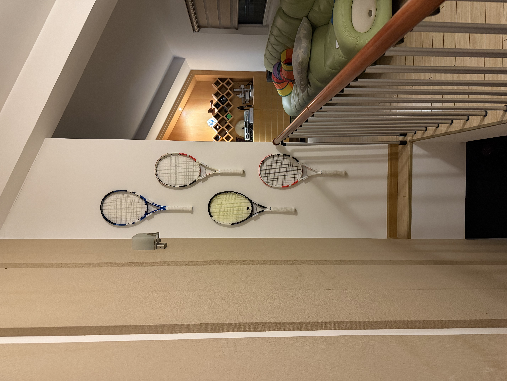

# 2026年6月 June 2026

## Mon Jun 22 22:44:30 CST 2026
周末摸鱼很多。而且开学了补补作业啥的就过完了。
明天去南京，后天会去学校。高三在的时间也少，翘课多，毕业之后也没回去过。

今天把和我爸的球拍挂起来了，很刁钻的位置，不过效果不错。
先是我妈淘宝上买了人家3D打印的支架粘在自己房间门上的，
我看不错，而且
[makerworld](https://makerworld.com/en/models/1279644-tennis-racket-wall-hanger#profileId-1324134)
上有原版模型（甚至评论有人问了淘宝卖的，作者未授权），
那不如自己打印了把我们的也上墙。
而且这个位置刚好对着空调，可以吹干手胶。

花了非常久啊，这卷耗材不知道为啥一直卡，一直卡。
不过还是有一个好的结果。

## Fri Jun 19 21:04:07 CST 2026
好的，更新一下，刚才那一段没看完，很长一段时间英语已经不这样了。
只是一些来自拉丁语的规定。

> Winston Churchill:
> This is the sort of English up with which I will not put.

## Fri Jun 19 20:44:43 CST 2026
通识课在学语言学，讲到一个关于prescriptive grammar的例子。

Do not end a sentence with a proposition.
Hence, "Where do you come from?" is grammatically incorrect 
and the "correct" way to say it would be "From where do you come?"

虽然这不是很重要，单纯的对与完全没听说过这件事表示十分震惊🤯。
而且感觉前者是一个经常听到的甚至我经常说的表达。

不过在语言学里我们不讨论这些，只研究descriptive grammar。
比如对于上面的例子我们会说第一种proposition结尾的用发很常见，
不会去判断和评价。

## Thu Jun 18 22:54:48 CST 2026
补充一下关于摇一摇广告。
我就想问，开发软件的这些人，你们是没收驾校钱吗。
我们是没给驾校钱吗。
软件写的一堆bug，交互还卡成啥样了，心思都放在摇一摇广告上了吗？
我不是一个介意广告的人，不过确实是不喜欢广告，
但是你们这软件又不是没有收入，这样搞真的有点恶心。
而且，也不是没有付费服务，解析什么是有付费的。
要是给个付费去广告的接口我也愿意，那请问是菜到这样的功能也做不出来吗。

纯骂，生气。

访问加速度传感器这件事本来就已经足够让人反感了。
访问的频率足够高，是可以高精度还原出一个人的运动状态的。
比如说，我沿着家里走一圈，理论上加速度传感器就可以还原出我的运动轨迹，
来还原我家的结构。
甚至这也是有应用的，比如地图软件在进入隧道无信号的时候，
就是利用这个来推断我开了多远，有没有离开隧道的。
虽然说苹果对访问频率的限制还是相对严格的，不太会有隐私泄漏风险。
但被这个摇一摇广告烦的，我真的想要加速度传感器也要授权才可以访问。

## Thu Jun 18 22:00:25 CST 2026
有点气到了，为什么这个神经驾考，要800分钟学时。
我他妈的把全部视频看完了也只有400分钟。
而且我之前看的时候还是专心看的。

本来非常开心的，学了一个下午，终于过了科目一模拟。
以为可以报名了，结果还要傻逼看视频。真的气到了。

驾校这个学习软件更是逆天，每次打开他妈的摇一摇广告，
我必须要把手机倚在桌上，要不然他妈的必跳转拼多多。

我真的要考虑不考驾照了，虽然说钱都交了。
那我说钱都花了，还找什么罪受。
反我到美国还要考驾照，美国驾照回国考科目一就可以换。
这几天就当提前准备科目一了。
若不是这样安慰，我实在是接受不了浪费这些时间。

还有那个驾校的工作人员，还说什么让我抓紧时间。
搞得好像所有人都很闲，每天没事干就围着你驾校转？
有句话说，一个人三十岁一事无成就会想象自己是个作家。
还有一句话说，一个人高中毕业无所事事就会去考驾照。
显得好像有点攻击高考完考驾照的，确实有点，但是只是单纯的对驾校生气，
不小心顺带骂到了。

这事真的是我脑子有问题，刚回国的时候状态还没有这么好，
要不然报名那天看那人那态度，包扭头就走的。
刚回来的时候也没有了解这么多政策，迷迷糊糊就报了名。

最他妈讨厌的事情就是浪费时间，浪费生命在这些形式，
在这些没有任何意义的事情上。让我感觉恶心，想吐。

说那么多，是真的生气，真的非常生气。
不过发泄了完了，冷静下来可能也还是会在国内考完。
毕竟伊利诺伊州可以凭借外国驾照和F1签证直接开车。
无论是近期要用车，还是练车都会方便很多的。
这样也可以继续自我安慰一下，主要是为了提前练车。

我，要么就不做，要么就好好做，用心做。

## Thu Jun 18 15:01:26 CST 2026
手胶，要常换。手胶，要用白色。

## Tue Jun 16 13:02:31 CST 2026
以前练琴最多算是手指灵活度联系，非常的糟糕。
感觉非常的不好，不知道自己在干什么。
最近研究了一些可以算是乐理吗，反正是数学，非常有趣。
不过要想让我小时候理解这些也不可能。
既不知道对数，更不知道微分方程。
不过就像之前说的，在更高一些的abstraction理解还是可以做到的。
这就真的只能怪当时没有这么做，或者也可以怪没有遇到好的老师。

张一弛说的，现在真的很好，想学什么可以立刻开始。
非常的同意，这一次我也没有系统的学习，只是不停的问。
今天晚些应该会分享一下学了什么，不过第一个问题只是吉他六根弦分别是什么音。
这样的学习过程真的很好。

以前听过很多人，高二的化学老师，还有B站上，分享过学习是输入输出。
他既是学习的过程，也是一个指标。
每次和克劳德老师对话的时候，我总是会复述我的理解。
甚至不是刻意的，就是自然的在输入之后输出。
再从回复中确认我的理解是没有错误的。
而且本身，复述这个过程也可以确保我没有“眼高手低”，强迫我从新走一边完整的逻辑。

## Sun Jun 14 22:07:58 CST 2026
暄雨，所以注册一个sunnyrains.com。
Sunny也确实是常见的名，Rains也是个姓。
这个意象我也很喜欢。
本来先想到的是喧雨，很吵闹的样子，我可以一点都不吵。
不过我又感觉xuan这个发音应该有的字是表示温柔的感觉。
然后就找到了寒暄的暄，确实是温暖的意思。

不过感觉这个联系非常隐晦，所以可能不一定会把这个网站搬过去。
目前就放放别的服务，放心，浏览器肯定直接看不到内容。
我还有一个奇怪的名字变化，比如方敛坤，方脸鲲。想象一个抹香鲸。
这是来自于每个字反过来的意思。
当然更有一些不能说的。

## Sun Jun 14 21:59:54 CST 2026
有一个非常特别的习惯，其实之前看我写内容截屏也可以发现，
就是在写markdown的时候，会在逻辑需要处主动换行。
而不是依赖wrapping。
比如写英文的时候从句会换行之类的。
这样写的好处就是用文本编辑器修改特别方便，光标的移动和写代码一样。
还有就是严格参照代码里的没行不超过80个字符标准，一眼可以看一行，
而且这一行逻辑是连在一起的，对我来说可读性也会增加。
不过写英文的时候没有问题，但是中文就有了。
就是在markdown渲染成网页的时候，会自动在换行处添加一个空格。
写英文没有问题，因为单词之间总有空格，但是中文就会有问题了。
所以最后只能在我自己的网站上打个布丁解决这个问题，不算一个clean fix。
但也没办法，主要原因可以理解为是我的一个癖好。

## Sun Jun 14 21:44:21 CST 2026
这两天因为别的
[小项目](../thoughts/bark.md)
买了VPS做服务器，这样的话可能过一段时间就会把网站也挪过去，
现在是在Github Pages。
这样的话，可以添加一些评论啊互动之类的功能。

而且这段时间网站技术上比较稳定了，没有太多改变。
之前就说要等稳定了总结一下是怎么做的，差不多就到时候了。
也许这两天就会写。

## Sun Jun 14 21:06:42 CST 2026
明天又要开始上学了。感觉好多好多事情啊。
要把他们都做好。

## Thu Jun 11 22:44:31 CST 2026
今天是狠狠vibe coding了一把。
我觉得挺好的。本来选用go是想要了解一下新语言。
确实了解了很多，不过确实因为不熟悉，自己就更不想写了。
几乎就是提结构上的意见，llm去执行。
效率确实高，可能今天有一千行代码的，要是自己写要写到什么时候啊。
不过有的时候很小很小很精致的东西还是自己写，
写代码本身确实是有乐趣的，会有很多小的有意思的东西，trick。
用llm就是只做code review，说白话的改进就没有那么有趣了。
但是就像前段时间写的插件，做很小很精致的东西，感受一下代码的乐趣也挺好的。

## Wed Jun 10 23:16:23 CST 2026
专业课学的最早的一个概念就是abstraction，
确实也是计算机这种人造学科非常重要的一个概念。
它是讲什么呢，就比如说，计算机很底层是逻辑门吧，或者更底层是晶体管。
但是作为一个写代码的，你不需要知道底层是如何用一堆nor和nand实现的，
更不需要晶体管的原理。
只需要在自己的这一层，遵守和上一层的约定，比如说API，就可以把整个事情做好。

最近用llm越来越多，明显感觉到，更多时间花在了更高的abstraction上。
就即使会去看它的逻辑，但是很多时候也不会一行一行的去看，
更多时候是做design choice。
比如说最近做的这个音频有关的项目，衔接音效llm选择runtime生成，
实际上就很没有必要，保存一个很小的文件反复用就可以，而且这样做更换还方便。

更通用一点，让我想到李andy分享的一个费曼的视频，
记者问了一个电磁力的问题，这个费曼有点懒得回答啊。
“为什么”这样的问题是没有尽头的，需要达到一个共识。
他举了例子说，出车祸为什么要打救护车。
因为人受伤了，为什么人受伤了要打救护车？因为要救人，
为什么要救人？不然会死，为什么不能死？或者，为什么是救护车不是飞碟？
大概是这样一个例子，记不清了。
其实这也是一个abstraction的问题。

## Tue Jun  9 19:27:25 CST 2026
因为看到一个讲记者通过文本分析找到中本聪的视频，
内容本身确实纯营销号啊，很多地方讲的狗屁不通。
但是让我有意无意的注意到自己写作或者是说话的一些特别用法。
比如某些不是日常的词汇使用频率比较高。
就包括我会比较喜欢用explicit，尤其是和llm对话的时候，
让他不要糊，少用简写，写代码的时候命名之白之类的意思。露骨一点。
还有就是skeleton，非常巧啊，又是骨头。
让llm刚开始的时候不要哗啦哗啦把整个项目写完，
先写的大概，让后一点一点添加这样更干净一点。

## Sat Jun  6 17:18:22 CST 2026
因为失去了一段记忆，现在变得比任何时候得更加珍惜记忆存在的痕迹。
很长一点时间，我不怎么拍照，我说不要去记录而忘记了记忆。
事实是相反的，正式这些记录，一遍遍提醒我不要忘记。
佩服我自己，做的如此彻底，不仅剔除了记忆，更是销毁了所有痕迹。

## Sat Jun  6 16:34:29 CST 2026
以前练了那么久琴，这么还是有这么多坏毛病，
都不注意。我这个右手老是没事就休息在一弦上。
或者就是大拇指休息在六弦上。

## Sat Jun  6 15:02:05 CST 2026
体会到了用古典弹民谣的痛苦，
Fsus2这个和弦，原版使用的拇指按六弦，
但是在古典琴上确实难以做到。
相信我可以克服的。

## Fri Jun  5 17:43:01 CST 2026
我已经六年没有碰吉他了，这两天拿出来。

不知到怎么说，很复杂很复杂。
但是和我后来学的很多东西不一样，它的开始不是我纯粹的兴趣。
也可以说是兴趣，但是那个时候，没有什么选择的意思。
我记得我包了很多很多的兴趣班，绘画，武术，跆拳道，书法，
我的天啊，就是仔细想一想的话有无数的事情。
很简单，我对所有的事情都充满了兴趣，还不懂的选择。
很巧合的，吉他就是其中之一。

那时候的所有兴趣，后来都逐渐放弃了，甚至吉他应该就是坚持最久的。
没错，需要用坚持这个词。在后来的生活中，我保持被无数更多更多的事情吸引。
我可以清晰的记得以前我并不喜欢吉他的音色。
但是也许是沉没成本，我一直没有放弃过，虽然没有由衷的喜欢过。
甚至初中之后，还学了一段时间古典吉他。
不过初中确实很忙，我便借这个机会放弃了。

我提炼不出来这件事让我知道了什么道理，只是叙述了。
但是我可以清晰的感受到，选择和对自我的认知，一直是我自己，很重要的主题。
也是这个故事的主题。

不过讲这个事，其实是说重新拿出来又开始练习了。
这次是由衷的。朋友给我分享了好听的民谣音乐，让我感受到了吉他的好听。
虽然是借口，但是以前虽然花了非常多的时间，更多是神经上的锻炼。
对吉他没有理解，完全不懂乐理，我可以说没有幸运的遇见好的老师。
但是都说了是借口，问题还是那个时候没有根据自己的心，要不然我会自己挖掘。
而且呢，这些记忆由于没有理解，时间长了确实会忘记。
我现在几乎没有办法反应过来任何和弦，也算是从零开始。
这次不一样的是，我会根据自己的心，弹喜欢的音乐，
路上一定会有更多乐理的理解，不过没有也没关系，只是为了做到想做的事。

顺便一说，留下的是一把古典吉他，因为比较贵？
但是弹民谣，诶无所谓了，当作异域风情了。

## Fri Jun  5 17:26:17 CST 2026
今天忙了很多家里的事情。

早上先是尝试修复了墙上的钟，但是失败了。
拆开之后板子腐蚀的过于严重了，触电完全没有了。
已经不是补锡可以修复的了，要么就飞线。
但是飞线要接到外壳上的触电有点过于难了。还是算了。
九块九买了个新的机芯。

然后又研究的把以前不用的窗帘改成球桌的罩子。
不用的时候防止落灰什么。本来是个拼色的窗帘。
拆开了，只用绿色哪一块布。但是拆开的部分是不整齐的。
要折一下做个缝线。

然后呢，就去研究家里的缝纫机了。
非常蠢的是，光把机子从桌面里翻出来就折腾了十分钟。
不能怪我啊，说明书上也没写，而且确实过于古早了。
然后就根据说明书慢慢搞起来。还是很有意思的。
但是现在还没有掌握好踏板的节奏，总是一不小心就让轮子转反了。
但是今天好累，换点别的事情来做。

于是上楼清理了球桌，用新买的刷子什么的。
推毛的的工具还是很好用的，可以明显看到平整。
现在再装空调，就等着吧。

维护一个房子，甚至都不用说家，
想这简单，还是挺麻烦的，各种各样的事情，随时随地的出现，

## Thu Jun  4 10:02:37 CST 2026
感觉做了一件很厉害的事情。
感觉是一件回头看可以称之为人生的转折点的事。
但是很遗憾的是没有办法分享太多。
如果说这是一个病的话，也确实是病。
可以理解为是张一弛发现我病了，潘浩宁让我没死，
卢梓杰帮我痊愈了。
虽然以前对大家都不好，但是我真诚的感谢生命中每一个把我当作朋友的人。
以后会对大家好。

## Tue Jun  2 13:55:36 CST 2026
感受过作息规律的舒服之后，通宵真的真的会死。

## Tue Jun  2 12:26:41 CST 2026
感觉做了一个很长很长的梦。

[冒险精神](https://music.apple.com/cn/album/%E5%86%92%E9%99%A9%E7%B2%BE%E7%A5%9E/1767971107?i=1767971112)
