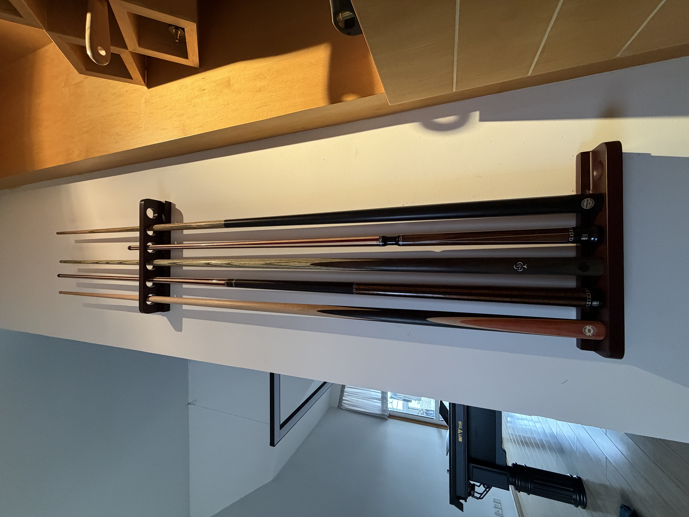
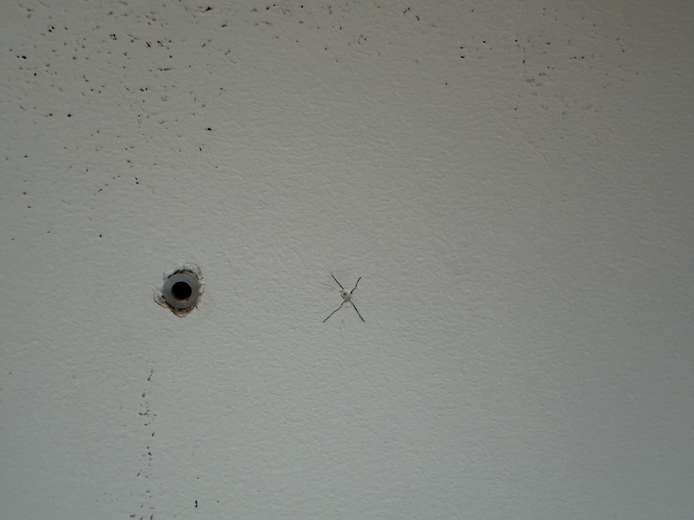

球桌已经到家有一点时间了。
但是和在球房打球不同，每次都是专门去练一两个小时，
现在基本上是有空就会去打几杆。
要是在球房，每次去，带个盒子，或者存个盒子没什么影响。
在家里，要是球杆一直放在盒子里，每次拿出来也不是很方便。
于是今天忙了一下，在墙面打了架子，都放起来了。

其实选架子的时候就遇到了麻烦。
大多数都是落地的，但是家里落地的就还是要占据额外的空间，
不如随便找个篓子放起来了。
所以最好就是上墙。

结果呢，就是虽然国内的制造业很发达，但是大多数产品都是给球房用的。
球房肯定是落地的方便就几乎没有什么上墙的选择。
有的几家虽然声称是实木，但是看起来木料做工很一般。
边缘的倒角做的也很不和谐，最终唯一看的顺眼的就是星牌。
不过星牌也没有什么选择，只有一个红木的颜色，也不是实木，
不过也已经是最美观的了。
其实我们学校球房就是这种上墙的架子，人家做的就很好。
奈何在国内很难找到，估计有也要定做。

原本的计划是安装在靠球桌的墙上，不过到家后发现比想象的短，
放在这里显得不太美观，于是挪到了背面，空间刚刚好。

然后就是安装，上下两部分各有四个膨胀螺丝，
算好居中的位置，墙面做好标记就可以了。
因为墙面是规则的而且不在天花板上，就很简单了。

不过顺便一提，标记的方法使用的画叉，就是高中物理实验强调的那种方法。
实际使用起来确实非常方便，相比于圈，叉的交点更明显，
所有的线条都在指引中心，而且哪怕钻头已经吧中心磨掉了，
也可以轻易的通过露出来的十字判断中心位置和误差多少。

还有关于钻头，一开始我没注意，用的是金属钻头。
后来才换了水泥专用的钻头。
后来顺便了解了更多的
[种类](https://www.bilibili.com/video/BV1hGu4zaEMx/)
还有上次提到金属膨胀螺丝钻头要比螺套粗2到3毫米，
这次用的是塑料的，就是一样的，都是六毫米。

不过值得注意的是，我是有一根跳杆的，
所以并没有像美国球房那样上下甲板之间预留很大的空间，
最多只可以一米左右，不过恰合的是，如果按照一米，
上板差不多就喝酒柜（一瓶酒没有）平齐，还是比较和谐的。
不过遗憾的是，我在打孔的时候，把那个标记的高度
当作是上方螺丝的高度，实际上是下方螺丝。
所以最后就差一点，不过也挺和谐的。
