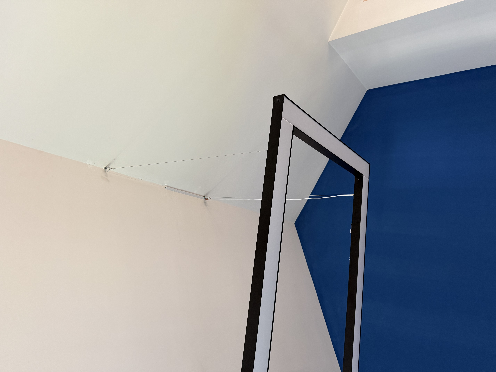

Recently I have been working on this website.
I was reminded of a problem I have heard and actually used before,
the metadata leak from images.

Even though it has been more and more well-known over the years,
it was quite rare to know about this when I first heard about it
in middle school.
I have to admit I did something really bad with this technique,
and it kind of cost me a friendship.
I used the GPS information from an original photo on WeChat to find the
location of my friend's neighborhood.
He was really mad at me, and we barely talked to each other ever again.
However, this time when I looked into it again, I found it 
was more serious than I thought.

## The leak

The tool I use is called `exiftool`.
And here is a photo I used in a previous 
[thought](../thoughts/pool-table.md).



To check out metadata, we use `exiftool ceiling.jpeg`.
As expected, I found GPS latitude and longitude data,
but what I was not expecting is how accurate this data is.
When putting the information into a map, it not only pinned our apartment
building but also the exact unit, which actually scares me a bit.

What I hadn't known is that GPS information can also show altitude.

```bash
GPS Altitude                    : 17.9 m Above Sea Level
```

17.9m is pretty much something like 4 to 5 floors which is also 
quite accurate. More information related to GPS are listed below.
They can tell us the facing direction, moving speed and time zone.

```bash
 GPS Img Direction: 273°
 GPS Speed: 0
 GPS Time/Date Stamp: 2026:05:31 06:03:30Z UTC
```

Besides GPS, it also has access to information from the accelerometer.

```bash
Acceleration Vector: (0.025, -0.786, 0.610) 
```

From this information we can calculate that the magnitude of acceleration
is approximately 1g, which we can use to infer that, besides
gravity, there is nearly no acceleration — so the camera was pretty much still.
In that case, we can use the value of each axis to determine that the
camera was facing about 38 degrees above the horizon.

We also have some more information related to device fingerprint like
camera model, software system. But those are kind of expected to be exposed,
so not really mentioned here.

## The Fix

We can also use the same tool to prevent the leak, which basically means
wiping all unnecessary metadata.

```bash
exiftool -all= -tagsfromfile @ -Orientation -ICC_Profile
```

It removes all metadata but restores orientation, which tells the image
viewer how to rotate the image, and the color profile, which may
affect color accuracy in some circumstances.

## Git History

As I am building this website using git and github,
all the images that has already been commited can potentially be restored
from history.
So to keep all my privacy safe, I made a clean clone. 
