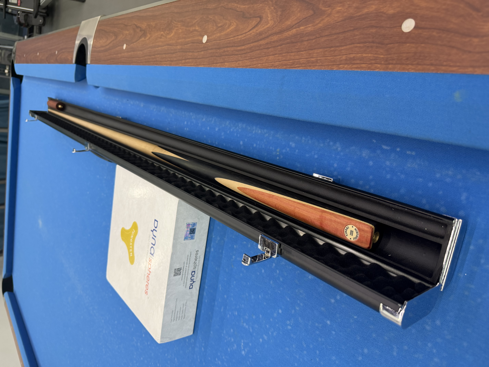
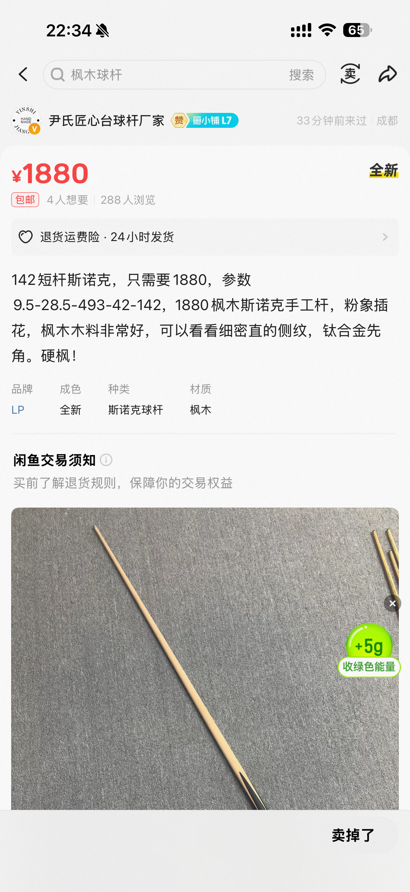
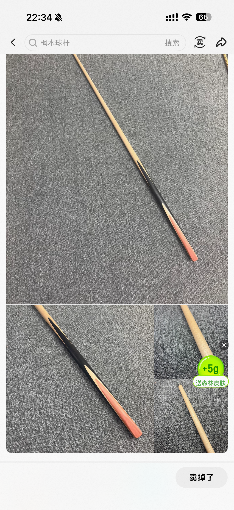

新买的球杆到了。

在美国用的打杆没有带回来，因为斯诺克通体刚好是超规行李。
这次回来用了我的第一根球杆，感觉非常的差。
球杆感觉没有弹性，让点非常大。
可能是一直放在家里受潮了的原因，而且本来我也没有好好爱护。
再加上上次换了非常硬 
[CC](https://centurycues.com/)
G4皮头，手感很奇怪(CC皮头总体不错的，我主要用G3，软一点但也够硬)。
还有本身这个杆子的后把很粗，超过30mm的直径，握着这也不舒服。
总而言是，就是感觉哪哪都变扭。我甚至觉得自己的冲杆都好打很多。
于是就买了新的球杆。

这次选的球杆还是比较特殊的。
首先作为一根斯诺克杆，他是枫木的。
枫木确实好看，没有所谓的剑纹，很干净利落。
没错，这就是我选择枫木的最主要原因，就是颜控哈哈。
当然了，理论上说枫木相比于白蜡木密度大，硬度小一点。
所以有观点认为让点更大，容错更小。
不过在美国用的就是枫木的斯诺克球杆，也不存在不适应。
而且我一直认为对于木头球杆来说，个体差异大于一切。
让点什么还是要适应球杆。尤其是我，让点没有系统。
完全不依赖
[前后手赛](https://drdavepoolinfo.com/FAQ/sidespin/aim/saws/)
，纯考挤开球的感觉。
当然，在美国我也试过很多低让点球杆，也是所谓的碳纤维，
不得不承认美洲豹 
[revo](https://predatorcues.com/pages/revo-carbon-fiber-pool-cue-shafts)
确实很好打。明显可以感受到的让点变小，力量扎实。
在美国打过三根不同参数的revo ：12.5mm，11.8mm, 甚至开伦款，都好打。
但是客观来说，也打过不好打的。
打过三支丘泰克，两支白科技玻璃纤维，一只同样有名的黑科技碳纤维
[cynergy](https://www.cuetec.com/cynergy/)。
这里面只有一支白科技是好打的，另外两支感觉都有点软。

其次这是一根短杆，只有142cm。
作为对比，正常来说标准的长度是145，甚至147(The Magic Number)也很常见。
但实际上，绝大多数人用不到这样长度的球杆，甚至手架距离是过长的。
[希金斯](https://en.wikipedia.org/wiki/John_Higgins)
也近年来也在用更短的球杆。
他就说那些一米八几的球员都在用标准长度，作为一个普通身材的球员，
没有理由也用这么长的球杆。
[戴维斯](https://en.wikipedia.org/wiki/Steve_Davis)
也常在采访中说，对于业余爱好者最有用的技巧就是缩短手架长度。
我嘛，算不上高（小巧灵活），在听了这么多之后，自然想要尝试一下短杆。
随后呢，就是在闲鱼上刷啊刷啊刷。然后就发现了它。

完美符合以上所有预期的球杆。而且有一个简单的粉象插花。
显得没有那么平庸。
最重要的是出场上的就是钛合金先角，也算是近几年比较有争议的技术。
理论上密度小，强度大，而且在杆头，可以缩小让点（没错又是让点），
而且本身材料也比黄铜抗腐蚀，稳定，时间长了磨损少，也不会和木头反应。
在美国的那根球杆还是传统的铜箍，就一直想要试试钛合金。
这完美的机会不就来了。
球杆是尹师傅做的，尹氏匠心。
品牌倒是不大，不过也算是听说过，看看咸鱼评价不错所以就果断尝试一下。

不过在发出之前，我还让加上了名牌。
觉得木头的就像工艺品，还是挺希望师傅刻上自己的标志的。
不得不说，国内物流确实快。
在美国的时候，我买优衣库要等半个月。
这里从成都发过来的球杆两天就到了，比预计的还早一天。
虽然之前就在评价里看到，但是还是超出意外的是，
球杆还送了铝盒，和实木延长把。
值得一提的是他们的这些周边，都没有logo，都是干净的颜色。
甚至要不是我要求加上名牌，球杆上也没有。
就有一种无印良品的感觉。
其实我是很喜欢这种理念的，毕竟谁想要天天免费给品牌打广告呢。

说到铝盒，其实对于球杆来说，它还是挺重要的。
保护球杆是一方面，还有确实比传统木制杆盒轻便很多。
在美国我用的是CC，另外一个CC（
[CueCraft](https://cuecraft.com/)
），的盒子。
光盒子就要接近两百刀。
虽然送的自然各方面差CC一点，
但是不得不说中国的制造业，量大管饱，公款成本低很多。

终于到了试杆环节。非常简单，就是好打。
可以不客观的说，是我用过最好打的球杆。
不知道是枫木和钛合金的组合的原因还是什么，让点非常符合直觉。
我没有加塞系统，这个让点的感觉就很重要。
revo虽然好打，但是碳纤维的球杆弹性让让点不太符合我的直觉，总是让多了。
这支就非常符合我慢慢积累的球感。
而且大家也应该注意到了，虽然这是一根斯诺克参数的球杆，杆头只有9.5mm。
但是我在国内大多数之后还是打的大球，
比如我试打的时候背景里就是一张抬高到中式高度的美式球桌。
打起大球也完全没有问题。
当然，九球这种经常需要更多的赛走多颗星线路的玩法，
用这样的锥度和硬度还是比较吃力的。
但是像
[fourteen-one](https://en.wikipedia.org/wiki/Straight_pool) 
这种小半台的玩法还挺合适的。
虽然对于杆法什么的，我还是认为个人因素大于一切，
但是像这根硬的斯诺克球杆打 
[stun](https://drdavepoolinfo.com/faq/stun/shot/)
确实会比打旋转要自然一点。

好了，这就是我关于这个新球杆的一些看法。
本来只是想写几句话分享在noise里面，但是越写越多，
干脆放在这了。

尹氏匠心的球杆还是推荐的。
至少基于我手上这一根，和尹师傅做事的风格是这样的。
