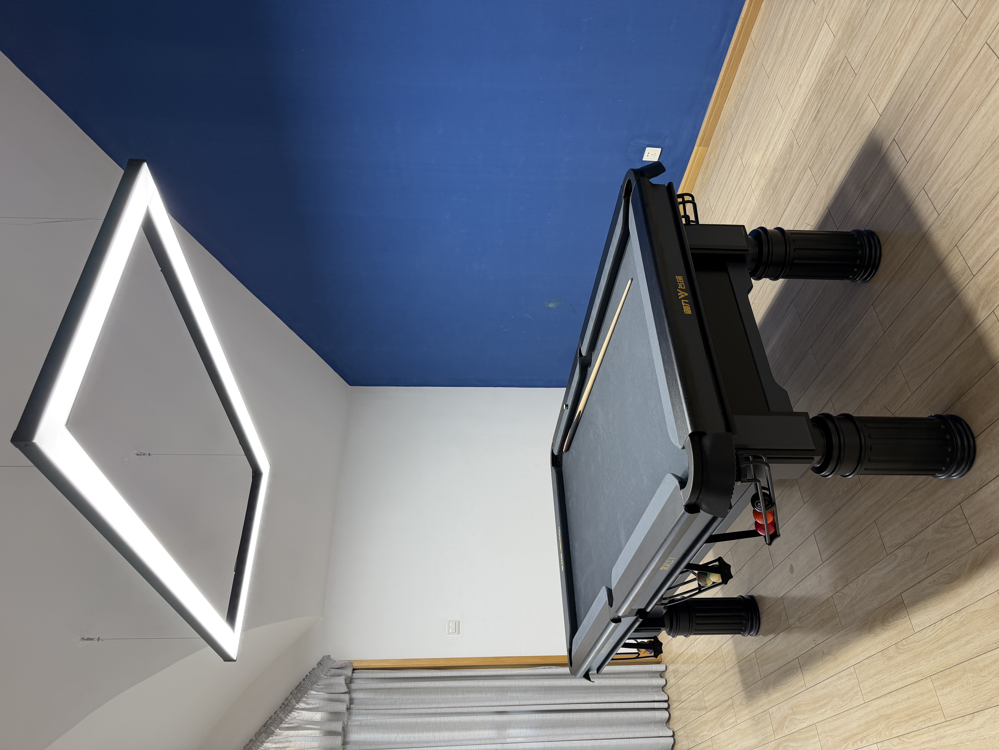
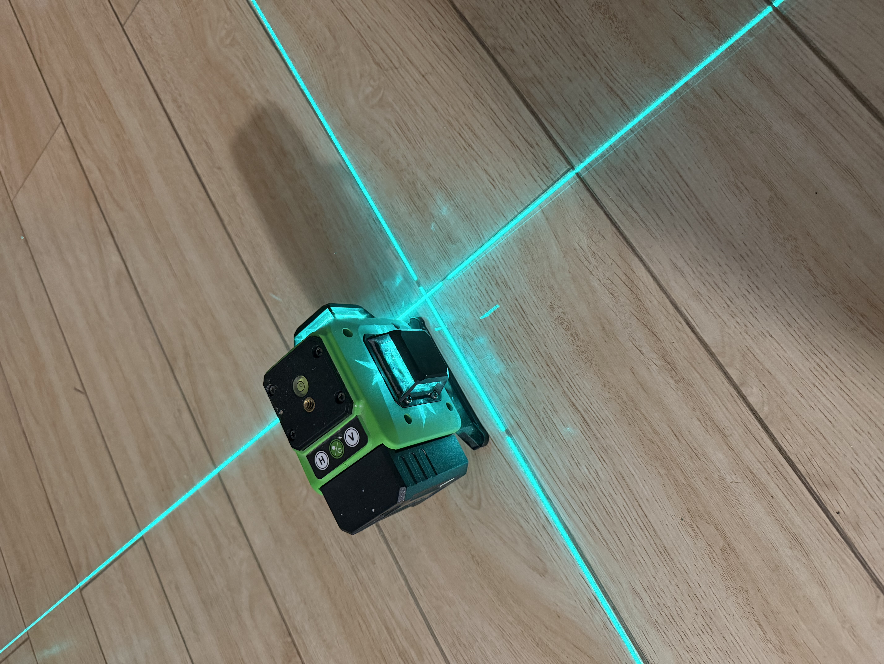
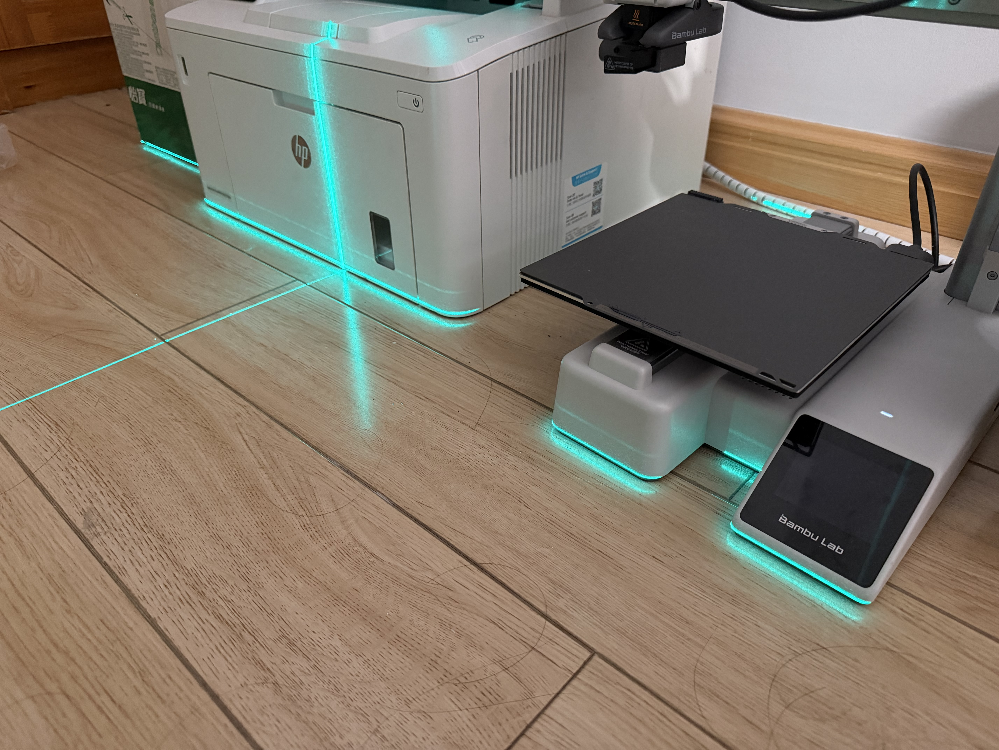
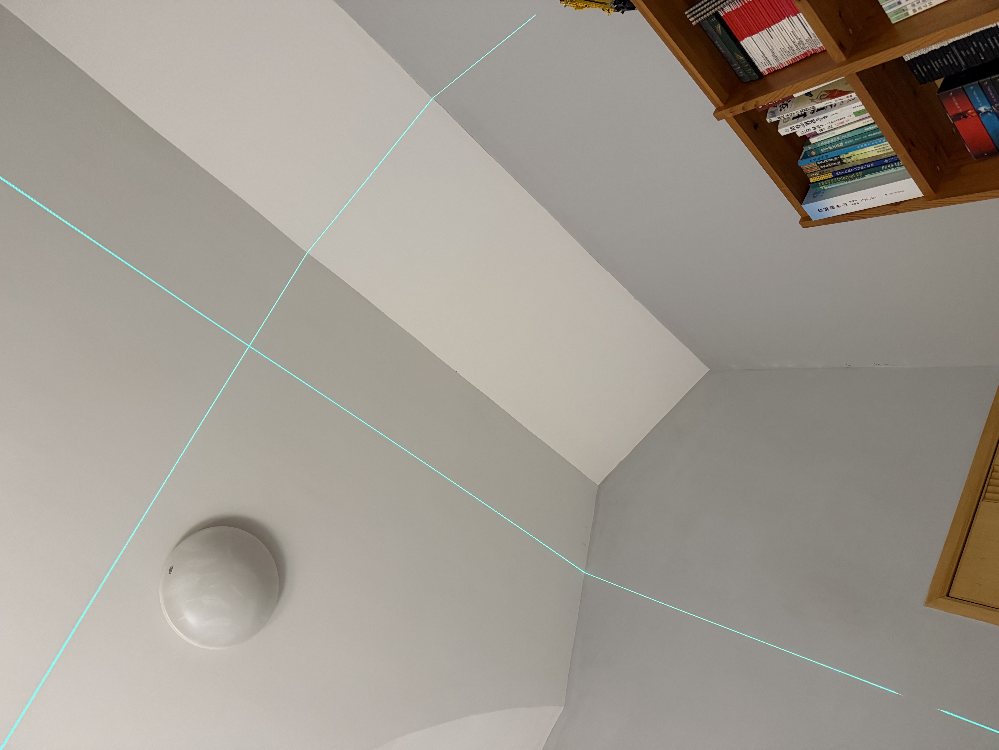
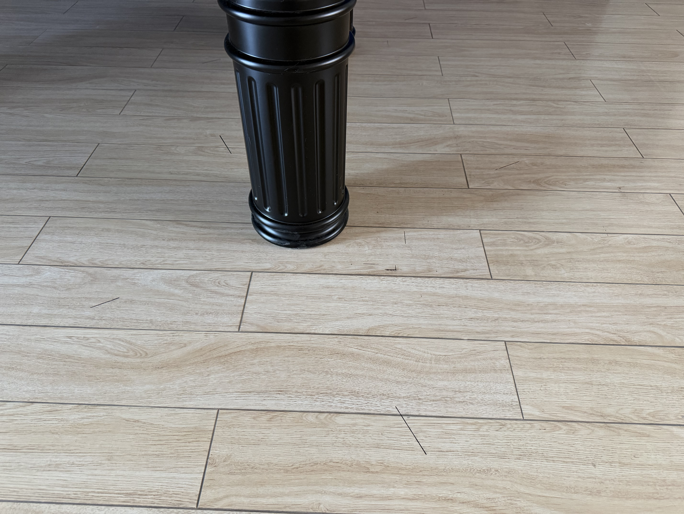

家里阁楼的客厅一直是空的。
只到最近，添加了一张台球桌。

从这个想法的诞生，到最后全部安装完成，
还是花了一点时间的，所以这里分享（炫耀）一下。

1. [准备](#准备)
    1. [球桌尺寸](#球桌尺寸)
    1. [无影灯](#无影灯)
1. [安装](#安装)
    1. [灯](#灯)
    3. [桌](#桌)

## 准备
### 球桌尺寸
考虑买桌子，第一步就是测量。
要知道家里客厅到底有多大空间，到底够不够舒适的摆下一张台球桌。
够的话能摆下多大的台球桌。

我们这里虽然阁楼的空间还是比较大的，但是唯一的问题是，
角落是有一堵承重墙的，所以并不可以利用到所有的空间。
经过测量，承重墙和其他墙面形成的小空间的长4.7m，宽3.9m。

这样的话标准的九尺台球桌虽然可以放下，但是周围就完全没有空间了。
一根球杆长不到1.5m，所以四周至少要留这么多空间。
如果是这样的计算的话，桌面尺寸大概就在长1.7m宽1m左右。
这基本就是标准的七尺台球桌（bar box: 2m x 1m）的尺寸。
虽然长度上我们还是差一点，但是考虑到，长度限制主要来自那堵角落的墙，问题不大。

然后就是找桌子。在美国，其实七尺的美式球台还是相当常见的。
也许和酒吧文化有关系，而且还有七尺台的职业赛事，美式小台各家都有做。
但是问题是，我们在国内。
想要没有什么正规厂商在国内有做这样的台子。
虽然很多没有牌子家装公司也做小尺寸的美式台球桌，但总觉得不太放心。
最终呢，是在淘宝上找了一张黑色的中式七尺台。
几乎就是唯一的选择，至少人家展示了用了什么石板、库边、台泥，
还会在当地找师傅安装，颜值上也看的过去，所以还是很方便的。

而且呢，在美国大袋口大多了，小桌子配个小袋口也算综合了尺寸上的缺点吧。

顺便一提，在美国也打过
[钻石](https://diamondbilliards.com/)
的七尺台。小台其实也很难，球的互相遮挡很多，打八球规则难度不会低。
对走位要求反而容错更小一点。

### 无影灯
下面就是选灯。
其实灯也不是必须的，普通家里的灯也可以。而且白天自然光也很好。
但是由于我们是在阁楼，有一个个三米七的挑高，而且房子久了，
之前一直用的是老式硬广灯管卡在横梁的缝隙里，所以亮度实在是不够看。
既然如此不如一起换了，选一个台球吊灯，日常也可以用。

看了很多，最终考虑到，由于那堵墙的原因，球桌中间
并不在横梁的位置，选择一个镂空的四角平面挂灯。
这样一来，即使没有对称性，也有几何的风格。

而且这样，根据我们的测量，横梁距离那面墙差不多就是1.5m，
如果选择两米左右的灯，由于灯的挂绳可以在灯长边的沟槽里移动，
我们可以左右调整把一侧的钢丝刚好挂在缝隙里，
这样一来，电线可以顺着那一侧的钢丝下来连到灯上。

其实现在
[wnt](https://matchroompool.com/)
的比赛基本看到的也是这个灯，甚至可能是一个厂商出的。
应为他是有110V电压的版本，还贵几十块。

## 安装
### 灯
由于层高，必须要在桌子上搭梯子才够得上顶。
但是又不想伤害球桌，只能先借用书桌装灯，最后装球桌。

装的时候还是遇到了一些挫折的，先请了别人来装，
第二天又全部返工了，和我爸两个人借了工具自己来装。
搞了半天，一直到晚上九点。
最后的成果还是满意的。
具体的挫折就不说了，就分享一下具体是怎么定位吊起来的。

最最最重要的工具就是激光水平仪。

之前已经提到，天花板是不规则的，所以定位其实是一个非常复杂的问题。
我们的方案是，先在地板上，让灯处于整个空间的正中间。
然后在地面上找挂钩的位置，然后利用激光水平仪找到天花板的对应位置。

简单介绍一下激光水平仪。
激光水平仪，有三个互相垂直的频道。
可以想象成一个坐标系，他们就是坐标系的三个基础平面。
除此意外，激光水平仪有自平衡功能，除了这三个频道的夹角锁定位90度，
它还可以通过自动或者手动水平仪保证底面的频道垂直于重力方向，
而其他两个频道平行于重力方向。

底面频道就是基本就是用来给地面找平的，我们用不到。
但是其他两个垂直频道就有大作用了。

可以看到，两条竖直激光相交于底面一点。
我们把这个点当作灯的一个顶点。
根据之前的数据，我们可以算出，这个点应该
距离整个阁楼空间长边1.35m，短边1.45。
我们可以利用激光测距仪轻易的找到这样的一个点。并且在底面做标记。
然后把激光水平仪的垂直平面交点放到那里，旋转调整激光水平仪，
去保证底面上打出来的两条线，与两面墙的距离始终一致。
这样我们就找到了交与这一点的两条与墙面平行的线，
而这两条线，就是灯的两边。我们可以把灯放过来。
这就是这个灯最终位置在地面的投影。

下面要确定挂钩位置，我们固定并标记好灯之后。
先找到钢丝更长边的位置。因为根据我们之前的设想，
这一边的挂钩应该刚好卡在横梁缝隙。
我们保证激光水平仪在地面上打出来的点位在灯挂绳的凹槽里。
沿着挂绳在长边移动，知道激光水平仪在顶部的交点位于横梁。
由于当时没有拍照片，这里图片用卧室天花板演示一下。
由于激光水平仪打出来这两个平面都是垂直与底面的，这两个交点的连线，
也是垂直于底面的。我们就成功找到了灯挂钩可以保证挂绳垂直的点位。

为了美观，和对称性，我们在灯长边的另外一侧找到与边框距离同样的点。
然后利用激光水平仪找到天花板的对应位置。

不过值得注意的是，由于天花板过高，必须要搭桌子加上梯子才可以够得到。
这个地面上的灯届时肯定要挪开，所以我们采用的方法是，
用马克笔在底面标记激光，这样只需要把灯挪开后，
让激光测距仪打出来的激光依然保持和底面标记重合，就可以保证位置正确。

最后就是在天花板上标记，然后打膨胀螺丝。
虽然说起来轻松，但是做起来确实花的时间最多的。
不过由于我确实虚，而且矮，这部分还是交给我爸。
不过值得一提的是，关于打膨胀螺丝的一些技巧。

比如金属的膨胀螺丝一般需要用偏大2mm到4mm的钻头打。
但是塑料的用同样直径的就可以。比如我们8mm的螺丝用的是12mm的钻头。
还有一点就是，用冲击钻或者电锤的时候不能着急啊，要不然很容易打不准。
可以用冲击钻的螺丝模式，或者就是小一点直径、功率的电动钻头先定位。
钻一个浅的洞，再用冲击钻或者电锤。

### 桌

桌面的安装就没有我们什么事了。主要是师傅安装。
我就在旁边看着。
之前没有意识到的一点是，其实桌面和腿不是固定住的。
单纯的依靠石板的重量放在了桌腿上。
然后地下是经典的螺栓调平系统。
甚至之前看到别人手搓隧穿显微镜也用这种。

还有就是台泥顺毛的方向。台面其实没有什么争议。
都是从顶库顺到底库，但是库边的方向是不一样的。
一般英式讲的是长边依然从顶库到底库，然后短边是顺时针。
但是师傅说
[乔氏](https://www.joy147.com/)
一般配的都是从中袋顺到底袋。
不过我们买的这个桌子没它没太讲究，比较随机。
不过裤边问题也不大就是了。

## End

基本上就是这样。用网上的话来说，就是实现台球自由啦。
开心。
